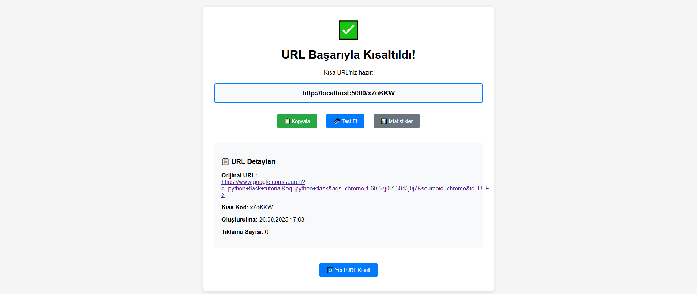
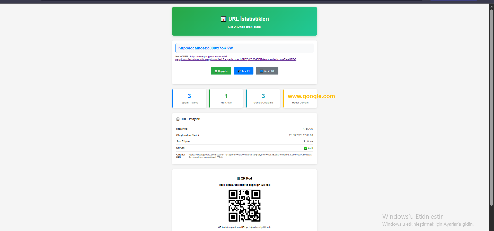

# 🔗 URL Shortener - Modern Link Management System

Modern, güvenli ve analitik destekli URL kısaltma servisi. Flask ile geliştirilmiş, production-ready bit.ly alternatifi.

[](https://python.org)
[](https://flask.palletsprojects.com)
[](https://sqlalchemy.org)
[](LICENSE)
[]()
[]()

---

## 🎯 Demo Sonuçları

### 💻 URL Kısaltma Arayüzü

<div align="center">
  
</div>

**Özellikler:**
- Temiz, modern tasarım
- Anlık URL doğrulama
- Özel kod desteği
- Responsive layout

### 📊 İstatistik Dashboard

<div align="center">
  
</div>

**Analitikler:**
- Gerçek zamanlı tıklama takibi
- Detaylı URL metrikleri
- QR kod üretimi
- Click-through oranları

### 📋 Son Eklenen URL'ler

<div align="center">
  
</div>

**Dashboard Özellikleri:**
- Toplam URL sayısı
- En çok tıklanan linkler
- Son oluşturulan URL'ler
- Görsel istatistikler

---

## 🚀 Hızlı Başlangıç

### Gereksinimler
- Python 3.8+
- pip (Python package manager)

### Kurulum

```bash
# Projeyi klonlayın
git clone https://github.com/username/url-shortener.git
cd url-shortener

# Virtual environment oluşturun
python -m venv venv
source venv/bin/activate  # Linux/macOS
# venv\Scripts\activate     # Windows

# Bağımlılıkları yükleyin
pip install -r requirements.txt

# Uygulamayı başlatın
python app.py
```

Tarayıcınızda `http://localhost:5000` adresine gidin.

---

## ⚡ Temel Özellikler

### 🔧 URL Yönetimi
- **Otomatik Kod Üretimi**: Benzersiz, güvenli kodlar
- **Özel Kod Desteği**: Kişiselleştirilmiş kısa linkler
- **Toplu İşlem**: Birden fazla URL'yi aynı anda işleme
- **URL Doğrulama**: Güvenlik ve format kontrolü

### 📈 Analytics & Tracking
- **Gerçek Zamanlı İstatistikler**: Anlık tıklama verileri
- **Detaylı Raporlar**: Tarih, konum, cihaz analizi
- **Export İmkanı**: CSV/JSON formatında veri çıktısı
- **Dashboard**: Görsel analitik paneli

### 🛡️ Güvenlik
- **CSRF Koruması**: Form güvenliği
- **Rate Limiting**: Spam önleme
- **Input Validation**: Kötü amaçlı içerik filtresi
- **HTTPS Redirect**: Güvenli bağlantı zorunluluğu

### 🌐 API Desteği
- **RESTful API**: Programatik erişim
- **JSON Response**: Standart API formatı
- **Authentication**: Token tabanlı kimlik doğrulama
- **Documentation**: Swagger/OpenAPI desteği

---

## 💾 Teknoloji Stack'i

### Backend
```python
Flask 2.3+          # Web framework
SQLAlchemy 2.0+     # ORM ve database
WTForms            # Form validation
Werkzeug           # WSGI utilities
```

### Frontend
```javascript
HTML5 + CSS3       # Modern web standartları
Vanilla JavaScript # Hafif, dependency-free
Chart.js          # Analytics görselleştirme
Bootstrap 5       # Responsive design
```

### Database
```sql
SQLite            # Development (varsayılan)
PostgreSQL        # Production önerisi
MySQL            # Alternatif production
```

### DevOps
```bash
Gunicorn         # WSGI server
Nginx           # Reverse proxy
Docker          # Containerization
GitHub Actions  # CI/CD pipeline
```

---

## 📚 API Kullanımı

### URL Kısaltma
```bash
curl -X POST http://localhost:5000/api/shorten \
  -H "Content-Type: application/json" \
  -d '{
    "url": "https://example.com/very/long/url",
    "custom_code": "mylink",
    "description": "Test link"
  }'
```

**Response:**
```json
{
  "success": true,
  "short_code": "mylink",
  "short_url": "http://localhost:5000/mylink",
  "original_url": "https://example.com/very/long/url",
  "stats_url": "http://localhost:5000/stats/mylink"
}
```

### İstatistik Sorgulama
```bash
curl http://localhost:5000/api/stats/mylink
```

**Response:**
```json
{
  "id": 1,
  "short_code": "mylink",
  "original_url": "https://example.com/very/long/url",
  "click_count": 42,
  "created_at": "2025-09-26T16:30:00Z",
  "last_accessed": "2025-09-26T17:45:00Z"
}
```

---

## ⚙️ Konfigürasyon

### Environment Variables
```bash
# .env dosyası
FLASK_ENV=development          # development/production
SECRET_KEY=your-secret-key     # Flask secret key
DATABASE_URL=sqlite:///app.db  # Database connection
REDIS_URL=redis://localhost    # Cache (opsiyonel)
```

### Production Ayarları
```python
# config.py
class ProductionConfig:
    DEBUG = False
    TESTING = False
    SQLALCHEMY_DATABASE_URI = os.environ.get('DATABASE_URL')
    SESSION_COOKIE_SECURE = True
    WTF_CSRF_ENABLED = True
```

---

## 🧪 Testing

### Unit Test'ler
```bash
# Tüm test'leri çalıştır
python -m pytest

# Coverage raporu
python -m pytest --cov=app

# Specific test
python -m pytest tests/test_utils.py
```

### API Test'leri
```bash
# Postman collection
newman run tests/api-tests.json

# Manual testing
python tests/manual_test.py
```

---

## 📦 Deployment

### Docker ile Deploy
```bash
# Image oluştur
docker build -t url-shortener .

# Container çalıştır
docker run -p 5000:5000 url-shortener
```

### Heroku Deploy
```bash
# Heroku CLI ile
heroku create your-app-name
git push heroku main
```

### VPS Deploy
```bash
# Gunicorn ile
gunicorn --bind 0.0.0.0:5000 app:app

# Nginx konfigürasyonu
sudo nano /etc/nginx/sites-available/url-shortener
```

---

## 🤝 Katkıda Bulunma

### Geliştirme Süreci
1. Fork yapın
2. Feature branch oluşturun (`git checkout -b feature/amazing-feature`)
3. Commit yapın (`git commit -m 'Add amazing feature'`)
4. Push edin (`git push origin feature/amazing-feature`)
5. Pull Request açın

### Code Style
```bash
# Black formatter
black app.py

# Flake8 linting
flake8 app.py

# Type checking
mypy app.py
```

---

## 📄 Lisans

Bu proje MIT lisansı altında lisanslanmıştır. Detaylar için [LICENSE](LICENSE) dosyasına bakın.

---

## 👥 Katkıda Bulunanlar

<table>
  <tr>
    <td align="center">
      <a href="https://github.com/username">
        
        <br /><sub><b>Developer Name</b></sub>
      </a>
    </td>
  </tr>
</table>

---


## 📞 İletişim

- **Email**: elifnuroksuz4@gmail.com
- **GitHub**: https://github.com/elifnuroksuzz
- **LinkedIn**: [[Your LinkedIn](https://linkedin.com/in/username)](https://www.linkedin.com/in/elifnuroksuz/)

---


## 🙏 Teşekkürler

- Flask topluluğuna harika framework için
- SQLAlchemy ekibine güçlü ORM için
- Tüm açık kaynak katkıcılara

---

<div align="center">
  <sub>⭐ Bu projeyi beğendiyseniz yıldız vermeyi unutmayın!</sub>
</div>


